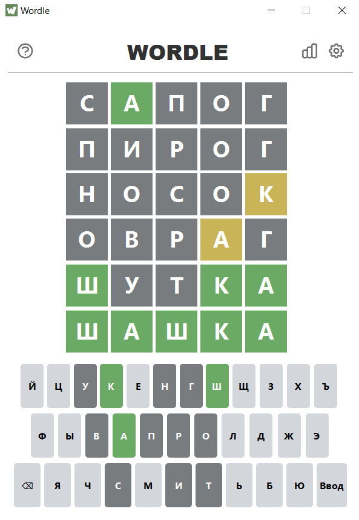
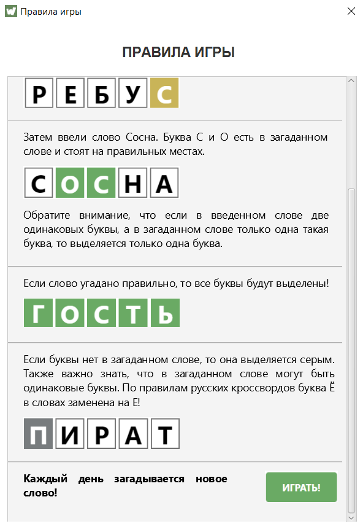
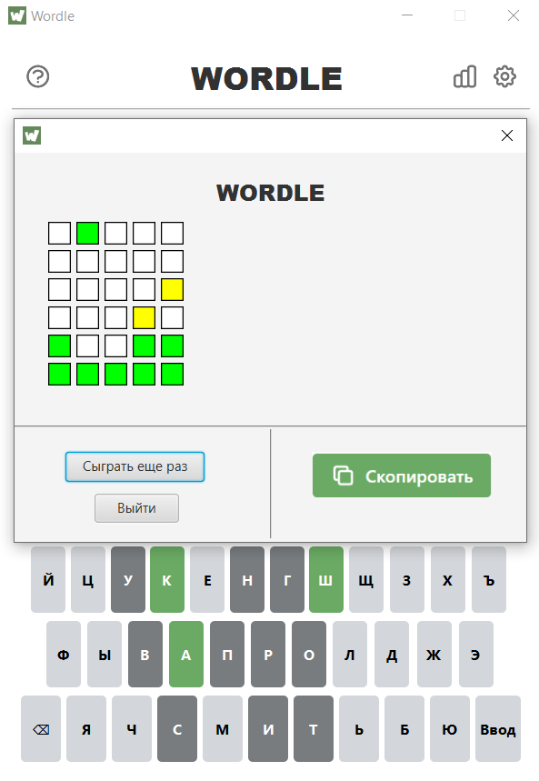
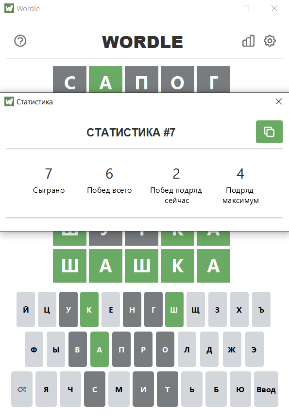

# WordleFX

----

## A simple implementation of Wordle game on JavaFX with FXML and CSS.

    
    
    
    

----

## What's the game?

    Wordle is a web-based word game developed by Josh Wordle, and then published by New York Times Company since 2022. Players have six attempts to guess a five-letter word, with feedback given for each guess in the form of colored tiles indicating when letters match or occupy the correct position.

----

## Code explanation
- `MainApplication.java` responsible for launching the application and for calling the appropriate methods in the controller to create some users interface elements.
- `MainHandler.java` implementing the basic logic of the application.
- `HelpWindow.java`responsible for opening the application window with the rules of the game.
- `AlertWindow.java` responsible for opening the application window with a warning about the absence of the entered word in the game dictionary.
- `ResultWindow.java` responsible for opening the application window with the results of the game.
- `SettingsWindow.java` responsible for opening the application window with the application settings.
- `StatisticsWindow.java` responsible for opening the application window with game statistics.
- `Statistics`
    - `Statistics.java` reads and writes game statistics to a file.
- `Controllers`
  - `MainController.java` is the controller for the main class `MainApplication.java`.
  - `HelpController.java` is the controller for the `HelpWindow.java`.
  - `ResultController.java` is the controller for the `ResultWindow.java`.
  - `SettingsConroller.java` is the controller for the `SettingsWindow.java`.
  - `StatisticsController.java` is the controller for the `StatisticsWindow.java`.