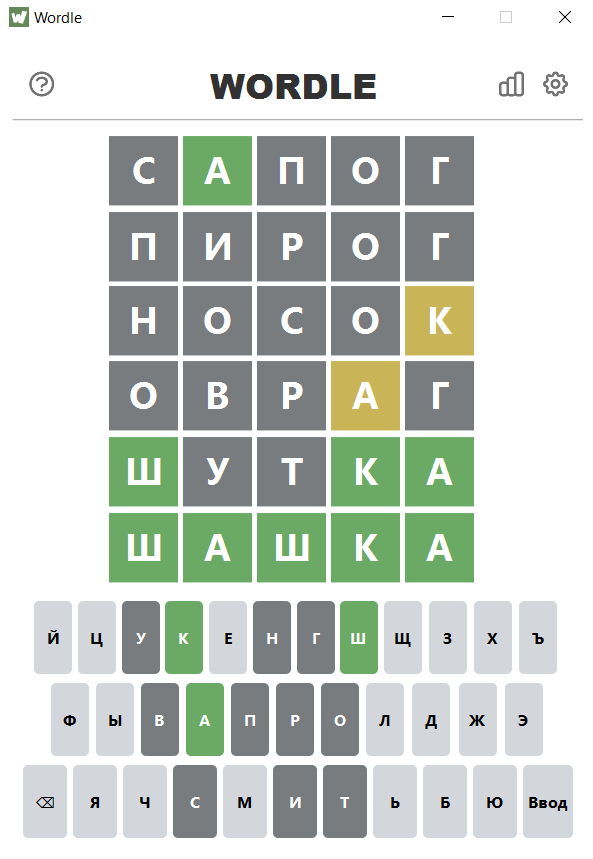
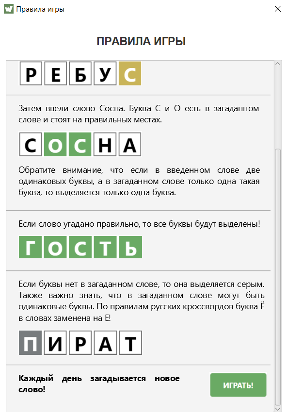
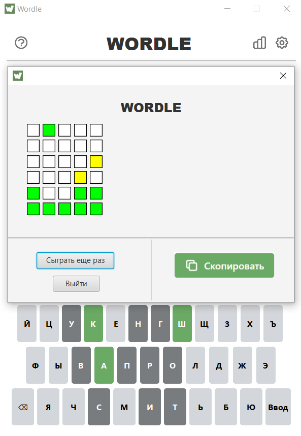
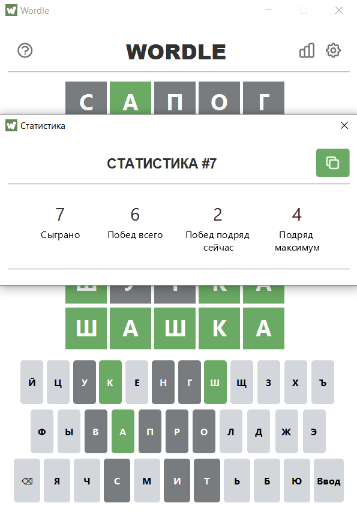

# WordleFX

----

## A simple implementation of Wordle game on JavaFX with FXML and CSS.

    
    
    
    

----

## What's the game?

    Wordle is a web-based word game developed by Josh Wordle, and then published by New York Times Company since 2022. Players have six attempts to guess a five-letter word, with feedback given for each guess in the form of colored tiles indicating when letters match or occupy the correct position.

----

## 